<p align="center">
  
</p>

<p align="center"><strong>A blazing-fast, lightweight frontend for MiSTer FPGA.</strong></p>

---

Degauss plays nice with the standard MiSTer setup, folders and scripts, instead of trying to replace it all.

It browses the games and folders on your card as they already are, with the artwork and
the metadata a scraper already wrote, and builds a beautiful, fast UI around them. It reads the
same folders the stock menu reads, so it agrees with the rest of your setup and scripts by
construction.

It runs without background processes and without replacing the stock system. It is optimised for
speed and for CRTs, with several views, a screensaver and a full set of options: it works out of
the box, and can be tuned to your liking.

Source available, written in Rust and using Slint, and licensed for non-commercial use.

> ### Star this repository to support it
>
> Degauss is written and maintained by one person in his own time. A star is
> the whole of what it costs you and the clearest signal that the work is
> worth continuing! If you want something changed or something is broken,
> [open an issue](../../issues/new/choose) and if you starred it I'll know it matters to someone beyond just fixing things :-)

## Using it

| Control | Does |
|---|---|
| **up / down** | move through lists |
| **left / right** | scroll speed, 0.5x to 12x. In a menu, change the setting |
| **A** (enter) | open a folder, launch a game |
| **B** (escape) | back, out of the folder |
| **X** (tab) | context menu: random game, random favourite, keep or drop a favourite, jump to letter, search, hide a row, change view, etc. |
| **Y** (space) | menu: options, help, about, exit |

A gamepad needs no setup and a keyboard is never needed. While Degauss
owns the screen, MiSTer sends the d-pad as arrows and the face buttons as
Enter, Escape, Space and Tab.

## Why Degauss

- **Three pillars.** Performance (for large libraries and images), Simplicity (vs overengineering), Adherence to the MiSTer way (standards, scripts, folders).
- **Fast.** 0.47 s from launch to first frame. 0.57 s to open a folder of
  12,605 games.
- **Artwork instant browsing.** Full-size pictures are read straight from
  the card as you scroll, with no thumbnails and nothing pre-generated.
  They keep up at the fastest scroll speed.
- **Nothing resident.** No service, no daemon, no port, no background
  process, nothing at boot. One program, running only while you are
  looking at it.
- **Small.** A 2.7 MB program, and no runtime, toolkit or library to
  install beside it. The index it builds costs about 300 bytes a game, so
  it stays in the low megabytes for an ordinary collection and is the only
  thing that grows with the size of yours.
- **CRT-optimised.** 352x240, 1:1 with the analog output, no scaler in
  between. Overscan margins and screen position are settings. Larger
  framebuffers are laid out from their own size, so HDMI works too.
- **The card is the truth.** Reorganise, rename or move files with any
  tool and the browser follows: nothing has to be re-imported or re-tagged.
  The index it keeps is only a copy of what the card already says, and
  **Options -> Rebuild lists** brings it back in step.
- **Full metadata.** Description, publisher, developer, release date,
  players and language, read from `gamelist.xml`.
- **Favourites are MiSTer's favourites**, written into `_@Favorites` in
  MiSTer's own format. One made here works in the stock menu; one made
  anywhere else appears here.
- **Nothing written to your card** except favourites you ask for, its own
  index, the `settings.toml` holding what you changed in Options, and a
  small `state.toml` remembering where you were. AmigaVision titles also
  need its own `shared/ags_boot` written to start the right game.
  Gamelists and artwork are read, never modified.
- **Awkward systems handled** without hassle: AmigaVision, DOS,
  Neo Geo, Arcade, X68000, and cores that are several machines.

Measured on the DE10-Nano's own hardware, with a large multi-system
collection indexed.

## Watch it in action

<!-- ONE thing to change when the upload finishes: replace both copies of
     VIDEO_ID below with the id from the YouTube URL. For
     https://youtu.be/dQw4w9WgXcQ the id is dQw4w9WgXcQ. -->

<p align="center">
  <a href="https://www.youtube.com/watch?v=w4dGS4kX35Q">
    
  </a>
</p>

## Screenshots

| | | |
|---|---|---|
| 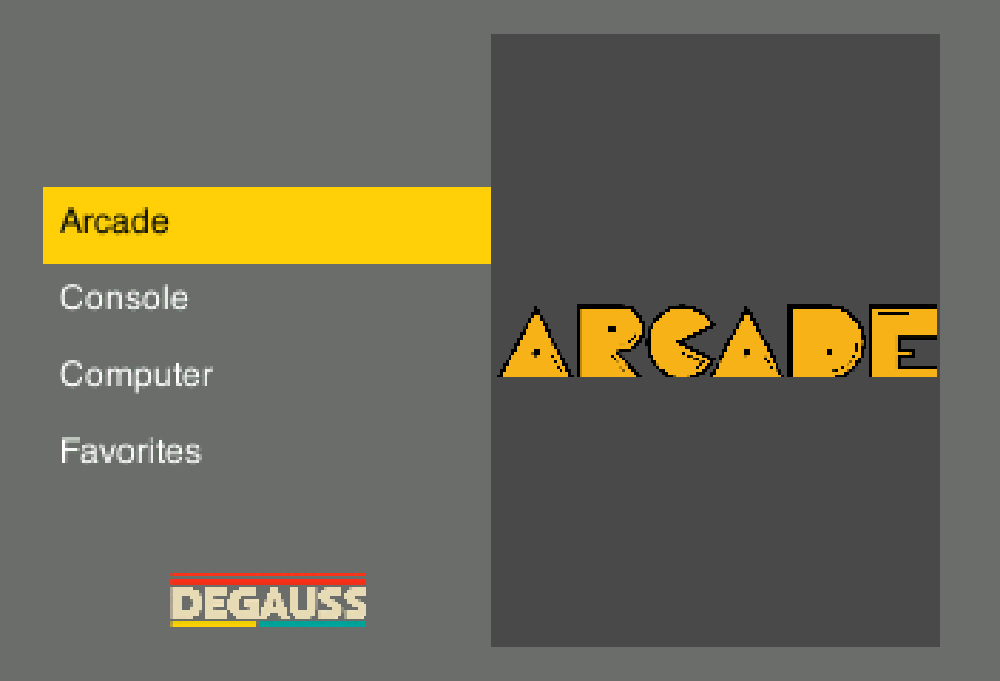 | 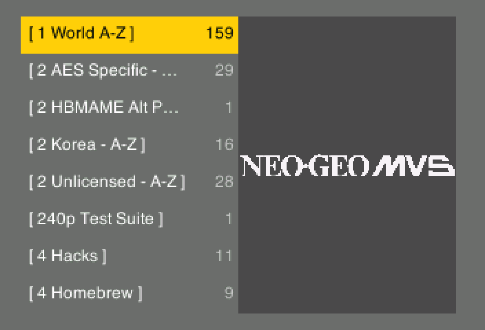 | 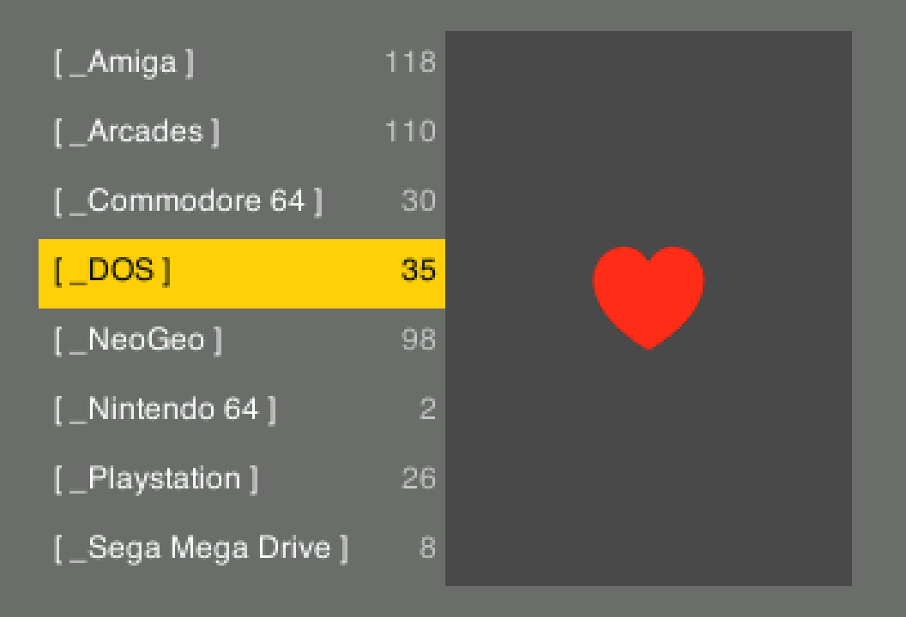 |
| The root menu | A system's folders | Inside the favourites |
| 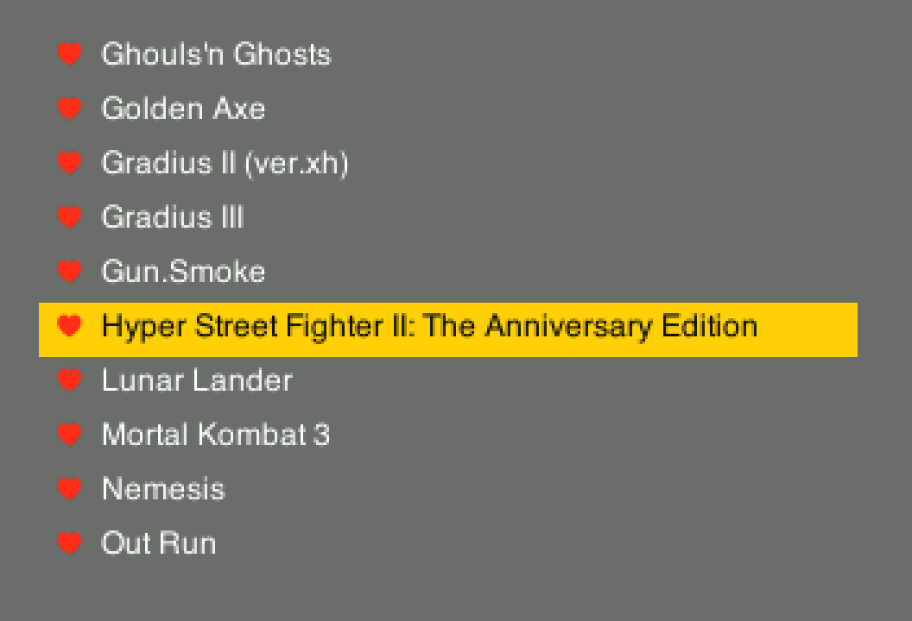 | 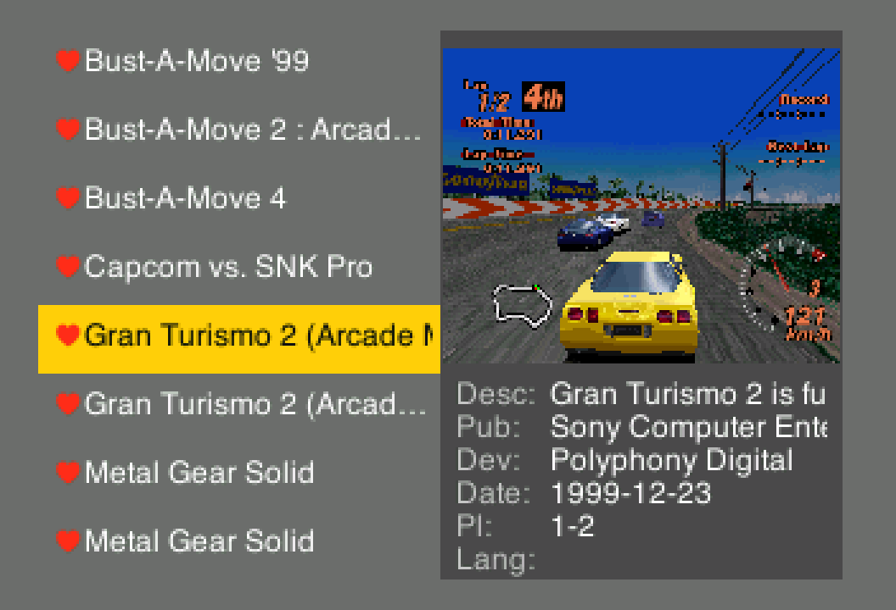 | 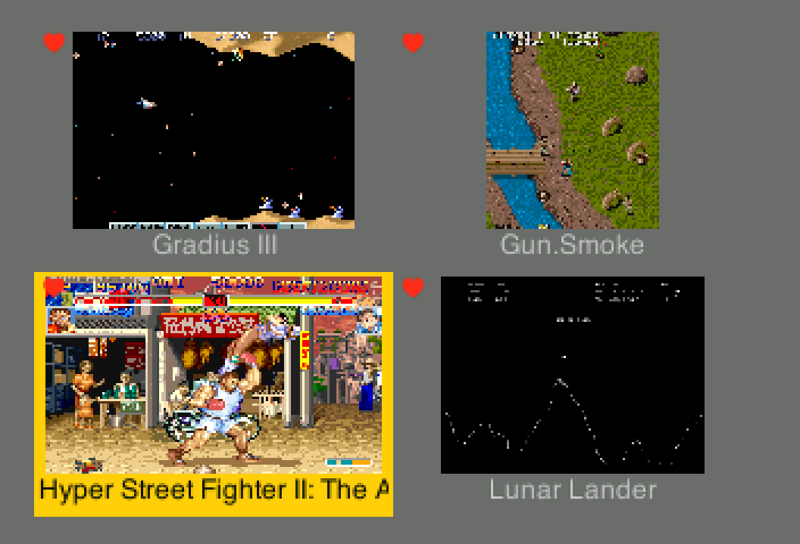 |
| List view | Details view, with metadata from gamelist.xml | Tiled view |
| 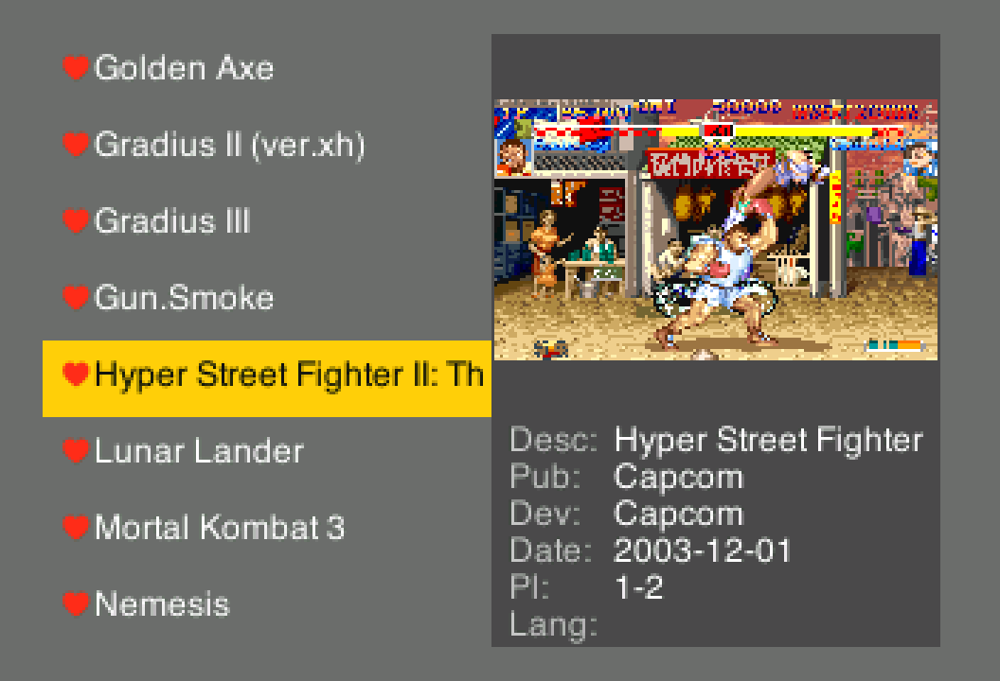 | 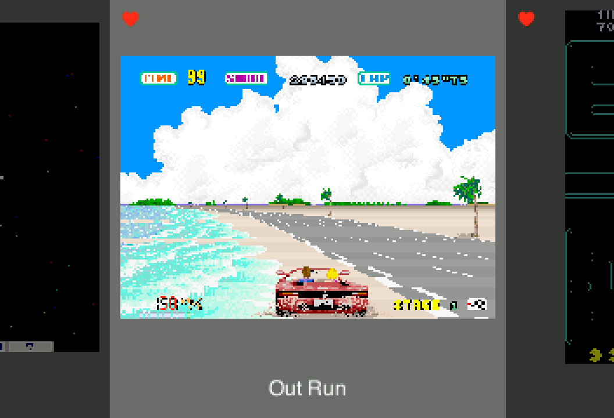 | 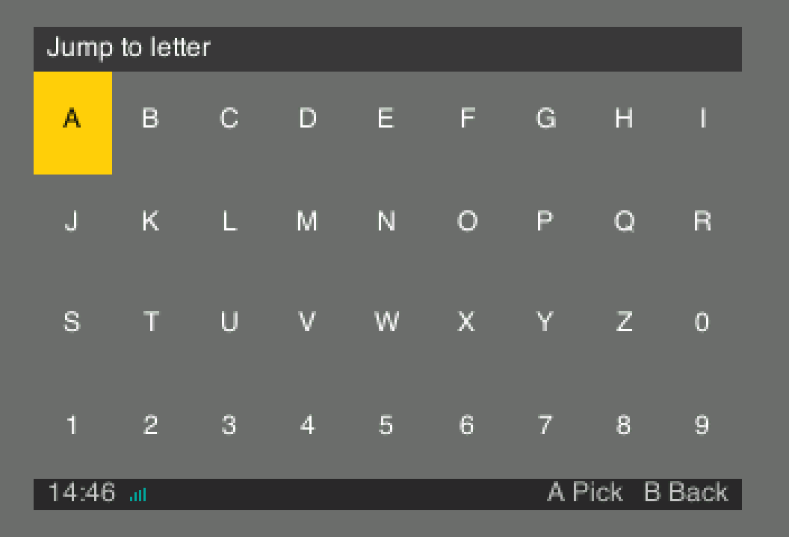 |
| Favourites are marked wherever they appear | Carousel view | Jump to letter |
| 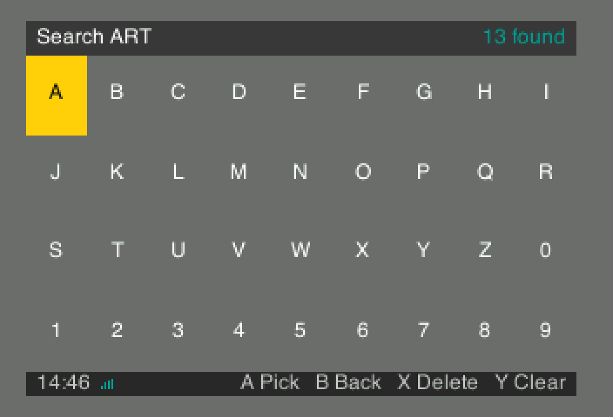 | 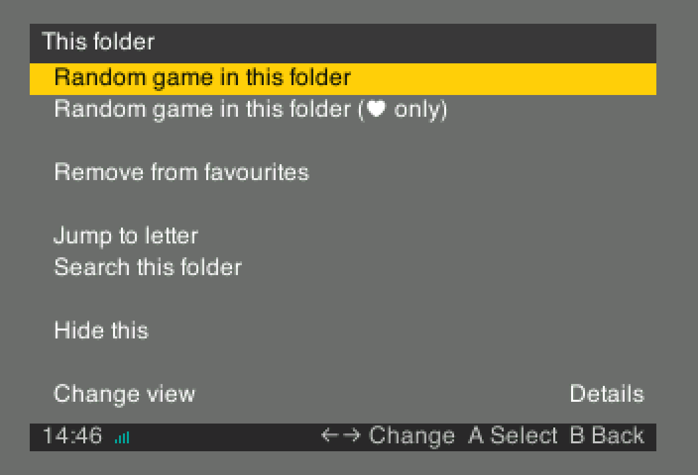 | 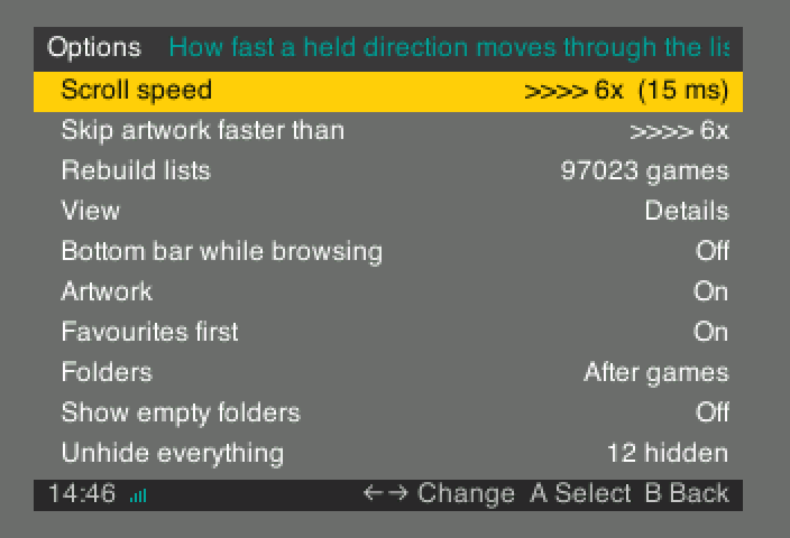 |
| Search inside a folder | Contextual actions | Options |
| 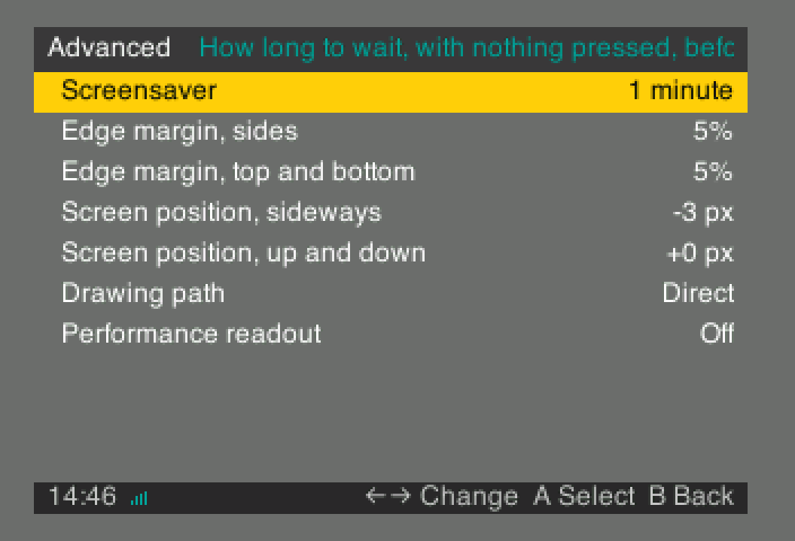 | 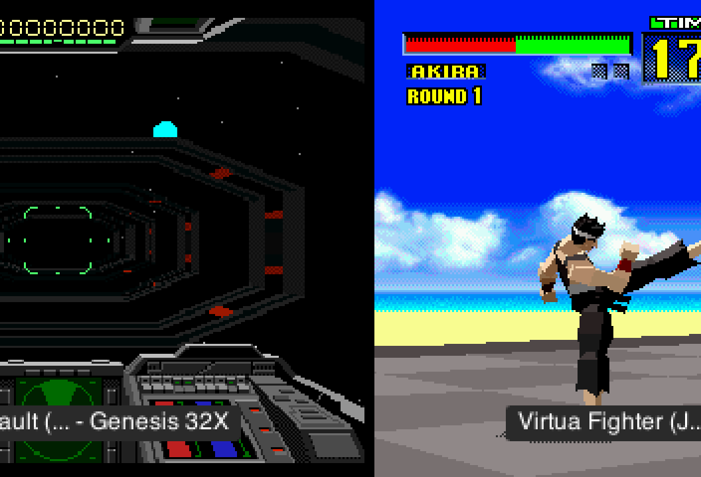 |
| Advanced options | The screensaver slideshow |

## Installing

Download the archive from the
[latest release](../../releases/latest) and copy its contents onto the card,
so the files land here:

```
/media/fat/degauss/MiSTer_Degauss
/media/fat/Scripts/degauss.sh
/media/fat/Scripts/.degauss/degauss
/media/fat/Scripts/.degauss/degauss.toml
/media/fat/Scripts/.degauss/systems.toml
/media/fat/Scripts/.degauss/logos/
```

Then add one line to the `[MiSTer]` section of `/media/fat/MiSTer.ini`:

```ini
main=degauss/MiSTer_Degauss
```

Reboot. Degauss comes up in place of the stock menu, and leaving a game
returns to it.

`MiSTer_Degauss` is a small fork of MiSTer Main that hands the screen over.
Its source is at
[giancarloerra/Degauss-Main](https://github.com/giancarloerra/Degauss-Main)
(branch `degauss`), under GPLv3 like MiSTer Main itself.
`degauss.sh` is how it starts the frontend (it's not meant to be launched from the
Scripts menu yourself).

To remove Degauss, delete the `main=` line and the files above. Nothing
else on the card is touched.

The first run reads the card and writes an index, about a minute for a
full one of 90k+ games. It never does that again on its own: **Options → Rebuild lists**
is how you tell it the card has changed (for example after adding new games). New images and metadata are read on the fly.

### Staying up to date

Degauss publishes a Downloader database, so `update_all` can keep it current
with everything else on the card. Add two lines to the bottom of
`/media/fat/downloader.ini`:

```ini
[degauss]
db_url = 'https://github.com/giancarloerra/Degauss/releases/latest/download/degauss.json.zip'
```

Then run `update_all` or `downloader` as usual, and both binaries and the
files beside them come down and stay updated.

The `main=` line still has to be added by hand, once. 

## Building it yourself

Every release carries a ready binary, so building is optional.

The dependency tree is pure Rust, so a cross build needs nothing but
rustup: no Docker, no C cross-compiler, no `arm-linux-gnueabihf-gcc`. Rust's
own linker and its self-contained musl do the work, and `.cargo/config.toml`
already selects them.

```bash
rustup target add armv7-unknown-linux-musleabihf
./scripts/build-arm.sh
```

That writes the binary and everything beside it into `deploy/Scripts`, ready
to copy onto the card. It builds on Linux, macOS and Windows alike.

`MiSTer_Degauss` is built from its own repository, which carries the script
that does it. That one is C++ and does need a cross-compiler.

## Views

- **List**: plain text, the most rows on screen.
- **Details**: the list beside a large picture, with what the gamelist
  knows underneath it.
- **Tiled**: a grid of pictures.
- **Carousel**: one large cover with its neighbours either side.

Folders appear in square brackets with the number of games inside them,
counted through every subfolder, and can sit before the games or after
them. Favourites carry a heart in every view and can be gathered at the
top of their folder.

**Hide this**, in the contextual menu, takes any row out of the list: a
game, a folder, or a whole system while you are looking at the system
list. That is separate from the folders and systems left out because they
hold no games at all, which **Show empty folders** governs. **Show what
you hid** shows the rows you hid without unhiding them, and **Unhide
everything** puts them all back.

The screensaver, after the set time, drifts through game images taken from your own
card.

## Settings

**Options**

| Setting | Does |
|---|---|
| Scroll speed | How fast a held direction moves through the list |
| Skip artwork faster than | Above this speed, pictures wait until the list stops |
| Rebuild lists | Read the card again. Run it after adding games, cores or artwork |
| View | Details, Tiled, List or Carousel |
| Bottom bar while browsing | The strip with the time and the buttons. Menus always keep it |
| Artwork | Turn pictures off entirely |
| Favourites first | Gather a folder's favourites at its top, in the same alphabet |
| Random | Whether a random pick starts the game, or only moves to it so you can look first |
| Folders | Where folders sit inside a system: first, or after the games |
| Show empty folders | Show folders and systems with no games in them. These are left out on their own. Off by default |
| Show what you hid | Show what you hid yourself with **Hide this** |
| Unhide everything | Put back everything you hid yourself, in every folder and every system |
| Show Other | Shows Others folder, usually the group holding cores that are not games |
| Show Utility | Shows the Utility folder, usually the group holding tests and measurement cores |
| Advanced | The screen below |

**Advanced**

| Setting | Does |
|---|---|
| Screensaver | How long with nothing pressed before pictures start |
| Edge margin, sides | Keep this much of each side clear of the bezel |
| Edge margin, top and bottom | The same, vertically |
| Screen position, sideways | Nudge the picture, for a screen that sits off centre |
| Screen position, up and down | The same, vertically |
| Drawing path | Draw into the screen directly, or into memory first |
| Performance readout | Replace the key hints with frame timings |

`degauss.toml` is documentation as much as configuration: every value
explains itself. Anything changed from the Options screen is written to
`settings.toml` beside it, so your changes never overwrite those notes.
Delete `settings.toml` to go back to the documented defaults.

## Artwork and metadata

Degauss reads `gamelist.xml` in the EmulationStation format, in the same
folder as the games. Paths inside it are relative to that folder. Nothing
else is needed and nothing is written back.

The minimum useful entry is a path, a name and a picture:

```xml
<gameList>
  <game>
    <path>./Boulder Dash.d64</path>
    <name>Boulder Dash</name>
    <screenshot>./media/screenshot/Boulder Dash.png</screenshot>
  </game>
</gameList>
```

Everything Degauss reads, in one entry:

```xml
<game>
  <path>./Gran Turismo 2 (Arcade Mode).chd</path>
  <name>Gran Turismo 2 (Arcade Mode)</name>
  <desc>Gran Turismo 2 is fundamentally based on the racing game genre.</desc>
  <publisher>Sony Computer Entertainment</publisher>
  <developer>Polyphony Digital</developer>
  <releasedate>19991223T000000</releasedate>
  <players>1-2</players>
  <lang>en</lang>
  <genre>Racing</genre>
  <favorite>false</favorite>
  <image>./media/covers/gt2.png</image>
  <screenshot>./media/screenshot/gt2.png</screenshot>
  <thumbnail>./media/thumbs/gt2.png</thumbnail>
</game>
```

`<image>`, `<screenshot>` and `<thumbnail>` are all read, in that order of
preference. `<releasedate>` is the EmulationStation timestamp form and is
shown as a date; a month or day of zero means only the year is claimed.
Only `<path>` is required.

The same file works for every system, awkward ones included. What changes
is only what `<path>` points at:

```xml
<!-- AmigaVision: a title inside the disk image, not a file on the card -->
<game>
  <path>./Games/Zool 2 (AGA)[en]</path>
  <name>Zool 2 (AGA)[en]</name>
  <image>./media/screenshots/zool2.png</image>
</game>

<!-- Neo Geo: the games are folders of ROMs -->
<game>
  <path>./mslug</path>
  <name>Metal Slug</name>
  <screenshot>./media/screenshot/mslug.png</screenshot>
</game>

<!-- Arcade: an .mra names its own core and ROM set -->
<game>
  <path>./DoDonPachi (World, 1997 25 Master Ver.).mra</path>
  <name>DoDonPachi</name>
  <screenshot>./media/screenshot/ddonpach.png</screenshot>
</game>
```

### Where the gamelist goes

One `gamelist.xml` at the top of each folder a system uses.

Paths inside it are relative to that folder, and subfolders are covered by
the same file. Most systems use a single folder under `/media/fat/games`:

| System | Gamelist |
|---|---|
| Commodore 64 | `/media/fat/games/C64/gamelist.xml` |
| SNES | `/media/fat/games/SNES/gamelist.xml` |
| PlayStation | `/media/fat/games/PSX/gamelist.xml` |
| Amiga | `/media/fat/games/Amiga/gamelist.xml` |
| Neo Geo | `/media/fat/games/NEOGEO/gamelist.xml` |

Some sit outside that folder, and some are spread over several. Every
folder gets its own gamelist, and the system is still shown as one:

| System | Gamelist |
|---|---|
| Arcade | `/media/fat/_Arcade/gamelist.xml` |
| PC (DOS) | `/media/fat/games/AO486/gamelist.xml`<br>`/media/fat/_DOS Games/gamelist.xml` |
| Genesis | `/media/fat/games/MegaDrive/gamelist.xml`<br>`/media/fat/games/Genesis/gamelist.xml` |
| Neo Geo CD | `/media/fat/games/NeoGeo-CD/gamelist.xml`<br>`/media/fat/games/NEOGEO/gamelist.xml` |
| SG-1000 | `/media/fat/games/SG1000/gamelist.xml`<br>`/media/fat/games/Coleco/gamelist.xml`<br>`/media/fat/games/SMS/gamelist.xml` |

Systems that share a folder share its gamelist: Neo Geo and Neo Geo MVS
both read `/media/fat/games/NEOGEO`.

`/media/fat/Scripts/.degauss/degauss --list-systems` prints where every
system resolved on your own card, which is the answer for that card.

<details>
<summary>Every system and the folders it reads</summary>

| System | Folders holding its gamelist |
|---|---|
| 3DO | `/media/fat/games/3DO` |
| Adventure Vision | `/media/fat/games/AVision` |
| Amiga | `/media/fat/games/Amiga` |
| Amiga CD32 | `/media/fat/games/AmigaCD32` |
| Amstrad CPC | `/media/fat/games/Amstrad` |
| Amstrad PCW | `/media/fat/games/Amstrad PCW` |
| Apogee BK-01 | `/media/fat/games/APOGEE` |
| Apple I | `/media/fat/games/Apple-I` |
| Apple IIe | `/media/fat/games/Apple-II` |
| Apple IIGS | `/media/fat/games/Apple-IIgs` |
| Apple Lisa | `/media/fat/games/LISA` |
| Arcade | `/media/fat/_Arcade` |
| Arcadia 2001 | `/media/fat/games/Arcadia` |
| Arduboy | `/media/fat/games/Arduboy` |
| Atari 2600 | `/media/fat/games/ATARI7800`<br>`/media/fat/games/Atari2600` |
| Atari 5200 | `/media/fat/games/ATARI5200` |
| Atari 7800 | `/media/fat/games/ATARI7800` |
| Atari 800XL | `/media/fat/games/ATARI800` |
| Atari Lynx | `/media/fat/games/AtariLynx` |
| Atom | `/media/fat/games/AcornAtom` |
| Audio | `/media/fat/games/MegaVGMDrive` |
| Bally Astrocade | `/media/fat/games/Astrocade` |
| BBC Micro/Master | `/media/fat/games/BBCMicro` |
| BK0011M | `/media/fat/games/BK0011M` |
| Casio PV-1000 | `/media/fat/games/Casio_PV-1000` |
| Casio PV-2000 | `/media/fat/games/Casio_PV-2000` |
| CD-i | `/media/fat/games/CD-i` |
| Channel F | `/media/fat/games/ChannelF` |
| CHIP-8 | `/media/fat/games/Chip8` |
| ColecoVision | `/media/fat/games/Coleco` |
| Commodore 16 | `/media/fat/games/C16` |
| Commodore 64 | `/media/fat/games/C64` |
| Commodore PET 2001 | `/media/fat/games/PET2001` |
| Commodore VIC-20 | `/media/fat/games/VIC20` |
| EDSAC | `/media/fat/games/EDSAC` |
| Electron | `/media/fat/games/AcornElectron` |
| Famicom Disk System | `/media/fat/games/NES`<br>`/media/fat/games/FDS` |
| Galaksija | `/media/fat/games/Galaksija` |
| Gamate | `/media/fat/games/Gamate` |
| Game & Watch | `/media/fat/games/GameNWatch`<br>`/media/fat/games/Game and Watch` |
| Game Gear | `/media/fat/games/SMS`<br>`/media/fat/games/GameGear` |
| Game Gear (2 Player) | `/media/fat/games/GameGear2P` |
| Gameboy | `/media/fat/games/GAMEBOY` |
| Gameboy (2 Player) | `/media/fat/games/GAMEBOY2P` |
| Gameboy Advance | `/media/fat/games/GBA` |
| Gameboy Advance (2 Player) | `/media/fat/games/GBA2P` |
| Gameboy Color | `/media/fat/games/GAMEBOY`<br>`/media/fat/games/GBC` |
| Genesis | `/media/fat/games/MegaDrive`<br>`/media/fat/games/Genesis` |
| Genesis 32X | `/media/fat/games/S32X` |
| Groovy | `/media/fat/games/Groovy` |
| Intellivision | `/media/fat/games/Intellivision` |
| Interact | `/media/fat/games/Interact` |
| Jaguar | `/media/fat/games/Jaguar` |
| Jaguar CD | `/media/fat/games/Jaguar` |
| Jupiter Ace | `/media/fat/games/Jupiter` |
| Laser 350/500/700 | `/media/fat/games/Laser` |
| Lynx 48/96K | `/media/fat/games/Lynx48` |
| M5 | `/media/fat/games/Sord M5` |
| Macintosh Plus | `/media/fat/games/MACPLUS` |
| Magnavox Odyssey2 | `/media/fat/games/ODYSSEY2` |
| Master System | `/media/fat/games/SMS` |
| Mattel Aquarius | `/media/fat/games/AQUARIUS` |
| Mega Duck | `/media/fat/games/GAMEBOY`<br>`/media/fat/games/MegaDuck` |
| MSX | `/media/fat/games/MSX` |
| MSX1 | `/media/fat/games/MSX1` |
| MultiComp | `/media/fat/games/MultiComp` |
| Neo Geo | `/media/fat/games/NEOGEO` |
| Neo Geo CD | `/media/fat/games/NeoGeo-CD`<br>`/media/fat/games/NEOGEO` |
| Neo Geo MVS | `/media/fat/games/NEOGEO` |
| Neo Geo Pocket | `/media/fat/games/NGP` |
| Neo Geo Pocket Color | `/media/fat/games/NGPC` |
| NES | `/media/fat/games/NES` |
| NES Music | `/media/fat/games/NES` |
| Nintendo 64 | `/media/fat/games/N64` |
| OpenBOR | `/media/fat/games/OpenBOR` |
| Orao | `/media/fat/games/ORAO` |
| Oric | `/media/fat/games/Oric` |
| PC (DOS) | `/media/fat/games/AO486`<br>`/media/fat/_DOS Games` |
| PC/XT | `/media/fat/games/PCXT` |
| PDP-1 | `/media/fat/games/PDP1` |
| PICO-8 | `/media/fat/games/PICO-8` |
| Playstation | `/media/fat/games/PSX` |
| PMD 85-2A | `/media/fat/games/PMD85` |
| Pocket Challenge V2 | `/media/fat/games/WonderSwan`<br>`/media/fat/games/PocketChallengeV2` |
| Pokemon Mini | `/media/fat/games/PokemonMini` |
| RX-78 Gundam | `/media/fat/games/RX78` |
| SAM Coupe | `/media/fat/games/SAMCOUPE` |
| Saturn | `/media/fat/games/Saturn` |
| Sega CD | `/media/fat/games/MegaCD` |
| SG-1000 | `/media/fat/games/SG1000`<br>`/media/fat/games/Coleco`<br>`/media/fat/games/SMS` |
| Sinclair QL | `/media/fat/games/QL` |
| SNES | `/media/fat/games/SNES` |
| SNES Music | `/media/fat/games/SNES` |
| Specialist/MX | `/media/fat/games/SPMX` |
| Super Gameboy | `/media/fat/games/SGB` |
| SuperGrafx | `/media/fat/games/TGFX16` |
| SuperVision | `/media/fat/games/SuperVision` |
| SV-328 | `/media/fat/games/SVI328` |
| Tandy MC-10 | `/media/fat/games/AliceMC10` |
| Tatung Einstein | `/media/fat/games/TatungEinstein` |
| TI-99/4A | `/media/fat/games/TI-99_4A` |
| TRS-80 | `/media/fat/games/TRS-80` |
| TRS-80 CoCo 2 | `/media/fat/games/CoCo2` |
| TS-1500 | `/media/fat/games/ZX81` |
| TS-Config | `/media/fat/games/TSConf` |
| TurboGrafx-16 | `/media/fat/games/TGFX16` |
| TurboGrafx-16 CD | `/media/fat/games/TGFX16-CD` |
| Tutor | `/media/fat/games/TomyTutor` |
| UK101 | `/media/fat/games/UK101` |
| VC4000 | `/media/fat/games/VC4000` |
| Vector-06C | `/media/fat/games/VECTOR06` |
| Vectrex | `/media/fat/games/VECTREX` |
| Virtual Boy | `/media/fat/games/VirtualBoy` |
| VTech CreatiVision | `/media/fat/games/CreatiVision` |
| WonderSwan | `/media/fat/games/WonderSwan` |
| WonderSwan Color | `/media/fat/games/WonderSwan`<br>`/media/fat/games/WonderSwanColor` |
| X68000 | `/media/fat/games/X68000` |
| ZX Spectrum | `/media/fat/games/Spectrum` |
| ZX Spectrum Next | `/media/fat/games/ZXNext` |

</details>

System logos are read from the `logos` folder beside `degauss.toml`,
named after the system. The 89 files in `assets/logos/` are copied from
lehcimcramtrebor/es-theme-forever (`CUSTOMIZE/logos`). The marks themselves 
are the trademarks of their owners, used here only to identify the systems.

## The command line (CLI)

Degauss is a normal program, so it can be run over SSH without taking the
screen. That is worth having for two things: finding out what it makes of a
card, and seeing what a change looks like without standing in front of the
machine.

```bash
/media/fat/Scripts/.degauss/degauss --help
```

Every flag below needs `--config` and `--systems` pointing at the two files
beside the binary, which is what `degauss.sh` does for you.

### Checking a card

| Flag | What it answers |
|---|---|
| `--audit` | Every system, one line each: games found, artwork bound, folders. A system with a `gamelist.xml` but no artwork bound, or with no games at all, is listed again underneath as a problem. A whole card checked without opening a hundred systems by hand. |
| `--list-systems` | Which systems this card actually has, and where each one resolved. The answer to "why is my system missing". |
| `--report` | One system in detail, with `--system <id>`. |
| `--dry-run-launch` | The MGL that *would* be written to start a game, printed instead of run. The answer to "why does this game not start". |

### Seeing it without the screen

`--render <file.bmp>` draws one frame to an image instead of the
framebuffer, which works while the frontend is running. `--screen`,
`--layout`, `--system`, `--select` and `--find` choose what that frame
shows. Every screenshot in this README was made this way.

```bash
degauss --system PSX --layout tiled --render /tmp/shot.bmp --geometry 352x240
```

### Measuring it

`--bench <frames>` scrolls a folder in memory and reports frame times,
decode cost and cache behaviour. It never touches the framebuffer, so it is
safe to run while the frontend is up. Run it twice and read the second: the
first pays for a cold card.

`--import-favorites <file>` writes a favourite per line of a list, in
MiSTer's own format, for moving a collection over in one go.

## Licence

Degauss is under PolyForm Noncommercial 1.0.0. See [`LICENSE`](LICENSE).

`MiSTer_Degauss`, shipped alongside it, is a separate program: a fork of
[MiSTer Main](https://github.com/MiSTer-devel/Main_MiSTer) under GPLv3, with
its source at
[giancarloerra/Degauss-Main](https://github.com/giancarloerra/Degauss-Main).
