<p align="center">
  
</p>

<p align="center"><strong>A blazing-fast, lightweight frontend for MiSTer FPGA.</strong></p>

<p align="center"><strong>Official website:</strong> <a href="https://misterdegauss.com">misterdegauss.com</a></p>

---

Degauss plays nice with the standard MiSTer setup, folders and scripts, instead of trying to replace it all.

It browses the games and folders on your card as they already are, with artwork and metadata
from EmulationStation gamelists or optional local MiSTer Game Artwork Databases, and builds a
beautiful, fast UI around them. Its optional ScreenScraper tool can add or update gamelist
artwork and metadata when you explicitly start it. It reads the same folders the stock menu
reads, so it agrees with the rest of your setup and scripts by construction.

It runs without background processes and without replacing the stock system. It is optimised for
speed and for CRTs, with several views, custom theming, different fonts, many features for favourites, browsing, lists, random discovery, a screensaver and a full set of options: it works out of the box, and can be tuned to your liking.

Source available, written in Rust and using Slint, and licensed for non-commercial use.

> ### Feature request or bug report? Star this repository as well to support it ⭐️
>
> Degauss is written and maintained by one person in his own time. A star is
> the whole of what it costs you and the clearest signal that the work is
> worth continuing! If you want something changed or something is broken,
> [open an issue](../../issues/new/choose) and if you starred it I'll know it matters to you beyond just requesting things :-)

## Screenshots

| | | |
|---|---|---|
| 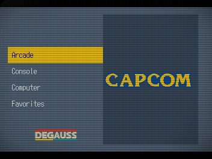 | 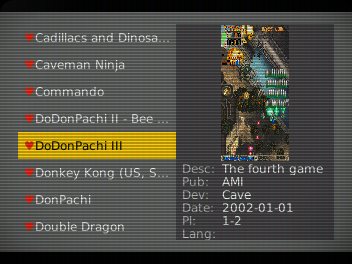 | 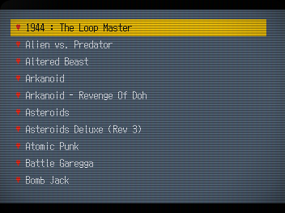 |
| Main Menu | Details View | List View |
| 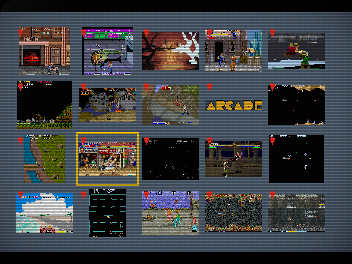 | 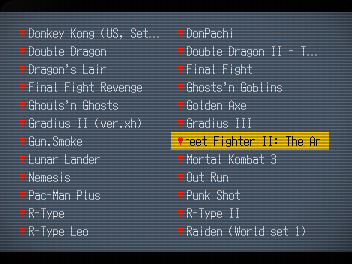 | 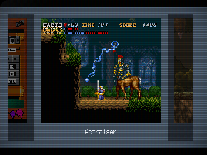 |
| Gallery View | Multi List View | Carousel View |
|  |  |  |
| Custom Theme | Amber Theme | Blue-Orange Theme |
|  |  |  |
| Mono Theme | Green Mono Theme | Modern Theme |
|  | 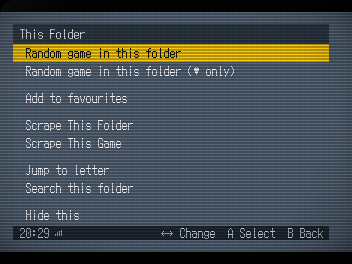 | 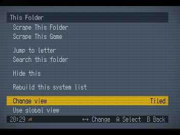 |
| Neon Theme | Search, Discover & Organise | A Different View for Every Place |
|  |  |  |
| Theme Editor | Category & System Image Picker | A Saved Custom Theme |
| 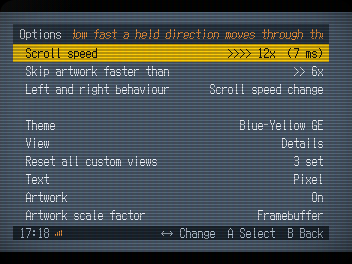 | 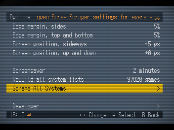 | 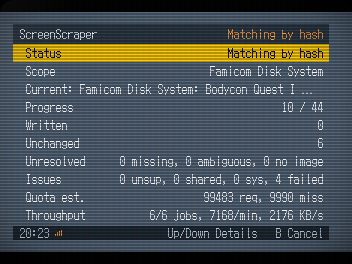 |
| Fully Configurable | Built-in Scraper, From One Game to Everything | Scraper Working Through a System |
|  | 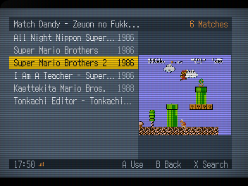 | 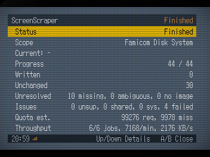 |
| Scraper Progress You Can See | Choose the Right Scraper Match | A Clear Completion Report |
| 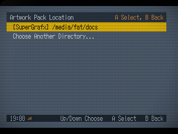 |  | |
| Use Existing MiSTer Artwork Packs | Screensaver Artwork Slideshow | |

## Watch Degauss 0.4.0 in action

<p align="center">
  <a href="https://www.youtube.com/watch?v=aFnvkkhbPFY">
    
  </a>
</p>

Click the image to watch Degauss 0.4.0 on YouTube.

## Table of contents

- [Using it](#using-it)
- [Why Degauss](#why-degauss)
- [Installing](#installing)
  - [Installing through Update All (recommended)](#installing-through-update-all-recommended)
  - [Installing through Downloader](#installing-through-downloader)
  - [Installing manually](#installing-manually)
  - [Upgrading from an earlier release](#upgrading-from-an-earlier-release)
  - [Returning to Degauss from a running core](#returning-to-degauss-from-a-running-core)
  - [Optional: starting Degauss from the stock menu on-demand](#optional-starting-degauss-from-the-stock-menu-on-demand)
  - [External storage support](#external-storage-support)
- [Views](#views)
- [Settings](#settings)
  - [Themes and colours](#themes-and-colours)
    - [Editing a theme on-device](#editing-a-theme-on-device)
    - [Proposing a theme for an official release](#proposing-a-theme-for-an-official-release)
- [Artwork and metadata](#artwork-and-metadata)
  - [Using MiSTer Game Artwork Databases](#using-mister-game-artwork-databases)
  - [Scraping with ScreenScraper](#scraping-with-screenscraper)
  - [Where the gamelist goes](#where-the-gamelist-goes)
  - [System and category images](#system-and-category-images)
- [Tips](#tips)
  - [Making the gamelists](#making-the-gamelists)
  - [Working with an agent](#working-with-an-agent)
    - [The one thing that catches everyone](#the-one-thing-that-catches-everyone)
    - [After any change](#after-any-change)
  - [Keeping the card in order (additional bonus!)](#keeping-the-card-in-order-additional-bonus)
- [The command line (CLI)](#the-command-line-cli)
  - [Checking a card](#checking-a-card)
  - [Seeing it without the screen](#seeing-it-without-the-screen)
  - [Measuring it](#measuring-it)
- [Building it yourself](#building-it-yourself)
- [Licence](#licence)

## Using it

| Control | Does |
|---|---|
| **up / down** | move through lists |
| **left / right** | scroll speed, 0.5x to 12x, or what the **Left and right** setting says: letter jumps, page jumps, or plain movement. In Options, left chooses the previous ordered value and right chooses the next; either direction toggles two-choice values |
| **A** (enter) | open a folder, launch a game; in Options, choose the next value or run an action |
| **B** (escape) | back, out of the folder |
| **X** (tab) | context menu: random game, random favourite, keep or drop a favourite, jump to letter, search, hide a row, rebuild this system, change view, etc. With **Hold X (1s) to add/remove fav** enabled, hold X for one second over a game to use the favourite shortcut |
| **Y** (space) | menu: options, help, about, exit |

A gamepad needs no setup and a keyboard is never needed. While Degauss
owns the screen, MiSTer sends the d-pad as arrows and the face buttons as
Enter, Escape, Space and Tab.

## Why Degauss

- **Three pillars.** Performance (for large libraries and images), Simplicity (vs overengineering), Adherence to the MiSTer way (standards, scripts, folders).
- **Fast.** 0.47 s from launch to first frame. 0.57 s to open a folder of
  12,605 games.
- **Artwork instant browsing.** Artwork is read straight from the card as
  you scroll, with nothing pre-generated. Gallery reduces visible images to
  its cell size in memory only. Nothing is written beside the artwork.
- **Nothing resident.** No service, no daemon, no port, no background
  process, nothing at boot. One program, running only while you are
  looking at it.
- **Self-contained.** One program, with no runtime, toolkit or library to
  install beside it, and small footprint while it runs. The optional scraper
  uses the `curl` command already included in a normal MiSTer installation.
  The index Degauss builds
  costs about 300 bytes a game, so it stays in the low megabytes for an
  ordinary collection and is the only thing that grows with the size of
  yours.
- **CRT-optimised.** 352×240 with 1:1 pixel mapping to a 15 kHz analog output.
  Overscan margins and screen position are settings. Larger
  framebuffers are laid out from their own size, so HDMI works too.
- **The card is the truth.** Reorganise, rename or move files with any
  tool and the browser follows: nothing has to be re-imported or re-tagged.
  The index it keeps is only a copy of what the card already says, and
  **Options -> Rebuild all system lists** quickly updates all systems after an update,
  and the contextual menu's **Rebuild this system list** does one system alone.
- **Full metadata.** Description, publisher, developer, release date,
  players and language, read from `gamelist.xml`.
- **Favourites are MiSTer's favourites**, written into `_@Favorites` in
  MiSTer's own format. One made here works in the stock menu; one made
  anywhere else appears here.
- **Awkward systems handled** without hassle: AmigaVision, DOS,
  Neo Geo, Arcade, X68000, and cores that are several machines.

Measured on the DE10-Nano's own hardware, with a large multi-system
collection indexed.

## Installing

### Installing through Update All (recommended)

Degauss is available directly in the official
[Update All](https://github.com/theypsilon/Update_All_MiSTer) settings. To
install it and keep it updated:

1. Run **Scripts → update_all** on MiSTer.
2. Press **up** during the opening countdown to enter Settings.
3. Open **Frontends**.
4. Select **Degauss** so it shows **On**.
5. If Update All offers its optional Game Artwork DBs, choose the ones you want
   or select **No**.
6. Return to the main Settings screen, choose **SAVE**, then **EXIT and RUN
   UPDATE ALL**.

<p align="center">
  
</p>

<p align="center"><em>Open Frontends in Update All Settings.</em></p>

<p align="center">
  
</p>

<p align="center"><em>Select Degauss so it shows On.</em></p>

Update All downloads the Degauss files, sets
`main=degauss/MiSTer_Degauss` in `MiSTer.ini`, and keeps the installation
current on later runs. MiSTer can use only one `main=` frontend, so selecting
Degauss switches any other frontend off.

To remove an installation managed by Update All, return to **Settings →
Frontends**, highlight **Degauss**, and choose **Uninstall**.

### Installing through Downloader

If you use MiSTer's Downloader without Update All, add these lines to the
bottom of `/media/fat/downloader.ini`:

```ini
[degauss]
db_url = 'https://github.com/giancarloerra/Degauss/releases/latest/download/degauss.json.zip'
```

Then run `downloader` as usual. Both binaries and the files beside them come
down and stay updated. Add this line to the `[MiSTer]` section of
`/media/fat/MiSTer.ini` once:

```ini
main=degauss/MiSTer_Degauss
```

### Installing manually

Download the archive from the
[latest release](../../releases/latest) and copy its contents onto the card,
so the files land here:

```
/media/fat/degauss/MiSTer_Degauss
/media/fat/Scripts/degauss.sh
/media/fat/Scripts/.config/degauss/degauss
/media/fat/Scripts/.config/degauss/degauss.toml
/media/fat/Scripts/.config/degauss/systems.toml
/media/fat/Scripts/.config/degauss/logos/
/media/fat/Scripts/.config/degauss/themes/
```

Then add one line to the `[MiSTer]` section of `/media/fat/MiSTer.ini`:

```ini
main=degauss/MiSTer_Degauss
```

Reboot. Degauss comes up in place of the stock menu, and leaving a game
returns to it.

To remove Degauss, delete the `main=` line and the files above. If a return
shortcut was configured, also delete
`/media/fat/config/degauss/frontend_shortcut.bin` to remove its saved
assignment. Nothing else on the card is touched.

### Upgrading from an earlier release

Earlier releases lived in `/media/fat/Scripts/.degauss/`. When updating
over one, `degauss.sh` moves everything into the new folder on its next
start, says `Migrating Degauss data to Scripts/.config/degauss...` on the
console while it does,
and removes the old folder: your settings, resume state and index carry
over, a `degauss.toml`, `systems.toml` or logo you edited stays the
active copy, and any other file you kept in the folder follows the move
untouched. There is nothing to do.

If anything about an install or upgrade looks wrong, the binary can look
itself over:

```bash
/media/fat/Scripts/.config/degauss/degauss --check-install
```

It reports what is present, missing, broken or still waiting in the old
folder, and says ok when there is nothing to say.

### Returning to Degauss from a running core

The recommended installation uses Degauss's `MiSTer_Degauss` Main binary.
While a game core is running, open the OSD and select **System → Frontend**.
Pressing A on **Frontend** keeps the direct route: it closes the current core
and returns to Degauss.

Select **System → Frontend shortcut**, directly below **Frontend**, and press A
to open the optional keyboard shortcut setting. It defaults to **Off**, so an
existing installation keeps its current input behaviour until it is configured.

Select **Keyboard** and press A, then press the physical keyboard key to
capture. Press X on the row to disable it. Menu or B cancels capture.

A configured shortcut works only while a non-menu core is running, the OSD
is unlocked, and no other framebuffer script owns the screen. The setting is
stored in `/media/fat/config/degauss/frontend_shortcut.bin`. A missing file
means the shortcut is Off. An invalid or unsupported file is identified in the
shortcut screen and can be replaced by selecting **Reset shortcut**.

This screen and shortcut belong to `MiSTer_Degauss`. They are not
available when Degauss is launched on demand from the stock Main binary as
described below.

### Optional: starting Degauss from the stock menu on-demand

The installation above is the recommended way to use Degauss. It opens Degauss automatically on boot, returns to it after leaving a game, and adds a **Frontend** entry to the System menu while a game is running.

If you prefer to keep the stock MiSTer menu as the default, leave the `main=` line as it is in `MiSTer.ini`. You can then start Degauss when wanted by opening the OSD and selecting **Scripts → degauss**.

This requires MiSTer's framebuffer terminal to be enabled:

```ini
fb_terminal=1
```

It is enabled by default in the standard MiSTer configuration.

Degauss can browse the collection and launch games normally when started this way. However, after leaving a game/core, MiSTer will return to the stock menu instead of reopening Degauss automatically. There's not going to be the Frontend option anymore in the cores menu, and you'll need to re-launch Degauss from the OSD if you want to go back to it.

Doing it in this way, the installed `/media/fat/degauss/MiSTer_Degauss` file is not used.

### External storage support

Games on a USB stick, the network share or the CIFS mount are found
without any setup, in the order MiSTer's own loader searches:
`/media/usb0` to `usb5`, then `/media/network`, then `/media/fat/cifs`,
then the card, each under its `games` folder. For each system folder the
first place that has it wins, so a system kept on both the stick and the
card browses from the stick, exactly as the stock menu would load it.
Different folders of one system may resolve in different places.

Two things to know. Storage is looked for when Degauss starts, so plug
the stick in first (or restart after); and moving a system between
storages changes its paths, so its listing is stale until **Rebuild this
system** or a full rebuild. A layout the defaults do not cover is one
`game_roots` edit in `degauss.toml` away.

The first run reads the card and writes an index, about a minute for a
full one of 97k+ games. It never does that again on its own: **Options → Rebuild all system lists**
is how you tell it the card has changed (for example after adding new games). New images and metadata are read on the fly.
Adding games to one system does not need the whole card read again:
**X → Rebuild this system list** inside that system reads just its folders.

## Views

- **List**: plain text in one column.
- **Details**: the list beside a large picture, with what the gamelist
  knows underneath it.
- **Tiled**: a grid of pictures with their titles underneath.
- **Carousel**: one large cover with its neighbours either side.
- **Multi list**: two text columns in reading order, showing twice as many entries
  as List. Only the selected long title scrolls.
- **Gallery**: a denser image grid with no permanent captions. The selected
  image has an outline and its title appears above the bottom bar for half a
  second. Entries without artwork remain visible as named text cells.

**Options → View** is the global default. Every browse place can instead
keep its own custom view: the Categories screen, each category's Systems
screen, each system root, and every folder inside a system. Use **X → Change
view** at that place to create or update its custom view. **X → Use global
view** removes only that place's custom view; it then follows later global
changes again. A custom view remains custom even when it currently matches
the global setting.

Folders appear in square brackets with the number of games inside them,
counted through every subfolder, and can sit before the games or after
them. Favourites carry a heart in every view and can be gathered at the
top of their folder.

**Hide this**, in the contextual menu, takes any row out of the list: a
game, a folder, or a whole system while you are looking at the system
list. That is separate from the folders and systems left out because they
hold no games at all, which **Show systems with no games** governs. **Show what
you hid** shows the rows you hid without unhiding them, and **Unhide
everything** puts them all back.

The screensaver, after the set time, drifts through game images taken from your own
card.

## Settings

**Options**

One screen holds everything, in groups a blank row apart, top to bottom:

| Setting | Does |
|---|---|
| Scroll speed | How fast a held direction moves through the list. 3x out of the box |
| Skip artwork faster than | Above this speed, pictures wait until the list stops. 6x out of the box |
| Left and right behaviour | What left and right do while browsing: Scroll speed change (the default), Letter, Page or Direction. Letter and Page repeat while held; in Direction, left and right move one entry and up and down move a whole row in Tiled, Multi list and Gallery |
| Theme | Left and right choose a palette. Press A to open the editor. Standard uses the colours in `degauss.toml`. See [Themes and colours](#themes-and-colours) |
| View | The global default for places without a custom view: Details, Tiled, List, Carousel, Multi list or Gallery |
| Reset all custom views | With A and confirmation, remove every place-specific view without changing the global View setting |
| Text | The typeface: Smooth, Pixel (a DOS font on whole pixels), and the bolder Smooth 2 and Pixel 2 |
| Artwork | Turn pictures off entirely |
| Artwork scale factor | Framebuffer keeps the original square-pixel fit and is the default. 4:3 and 16:9 correct game artwork for that physical display shape in Details, Tiled, Carousel and Gallery. Category logos, system logos and the screensaver are unchanged |
| Bottom bar while browsing | The strip with the time and the buttons. Menus always keep it |
| Favourites first | Gather a folder's favourites at its top, in the same alphabet |
| Hold X (1s) to add/remove fav | Off by default. Hold X for one second over a game to open the normal favourite-folder chooser, or to remove it when it is already a favourite. The shortcut does nothing in the master Favourites system |
| Folders before games | On, folders lead a system's listing; off, the games come first |
| Random game behaviour | Whether a random pick starts the game, or only moves to it so you can look first |
| Show Other folder | Show the Other group, the cores that are not games |
| Show Utility folder | Show the Utility group, test patterns and measurement cores |
| Show systems with no games | Systems and folders holding nothing are left out on their own; this shows them. Off by default |
| Show what you hid | Show what you hid yourself with **Hide this** |
| Unhide everything | Press A and confirm to put back everything you hid yourself, in every folder and every system. Left and right do nothing |
| Edge margin, sides | Keep this much of each side clear of the bezel |
| Edge margin, top and bottom | The same, vertically |
| Screen position, sideways | Nudge the picture, for a screen that sits off centre |
| Screen position, up and down | The same, vertically |
| Screensaver | How long with nothing pressed before pictures start |
| Rebuild all system lists | Press A to read the whole card again. Run it after adding games, cores or artwork; for one system, the contextual menu's **Rebuild this system list** is quicker. Left and right do nothing |
| Developer | Press A to open the screen below. Left and right do nothing |

**Developer**

| Setting | Does |
|---|---|
| Drawing path | Draw into the screen directly, or into memory first |
| Performance readout | Replace the key hints with frame timings |

`degauss.toml` is documentation as much as configuration: every value
explains itself. Anything changed from the Options screen is written to
`settings.toml` beside it, so your changes never overwrite those notes.
Delete `settings.toml` to go back to the documented defaults.

### Themes and colours

The ten palette colours Degauss draws with are roles in the `[colors]`
block of `degauss.toml`, validated as `#rrggbb` when the file is read
(the wordmark's `logo` colour, below, is the one colour that lives
outside it):

| Role | Does |
|---|---|
| `background` | The ground behind everything |
| `panel` | The title strip across the top of menu screens |
| `surface` | Raised surfaces: cards, the artwork plate, modal panels |
| `bar` | The strip along the bottom, darker so its small text reads |
| `text` | Ordinary text |
| `text_dim` | Secondary text: counts, hints, the clock |
| `accent` | The selection bar and focus ring |
| `accent_text` | Text drawn on top of `accent` |
| `state` | Toggles, progress, anything that is "on" |
| `favorite` | The favourite markers |

A theme is one `.toml` file in the `themes/` folder beside `degauss.toml`
(`Scripts/.config/degauss/themes/` on a card), naming any of those ten
roles, and its file stem is its name in the **Theme** row of Options.
The roles go in as bare keys or under a `[colors]` header, so the block
from `degauss.toml` pastes in unchanged. A theme overlays your
`[colors]`: roles it does not name show through from `degauss.toml`. One
more key, `logo`, at the top level, draws the wordmark as a flat
silhouette in that colour; leave it out and the wordmark keeps its own
three colours. The optional top-level `logo_opacity` is an integer from
`0` to `100`: `0` keeps the original three-colour artwork, `100` uses only
the selected `logo` colour, and values between them blend the two without
making the wordmark transparent. Leave it out and a named `logo` colour
keeps the fully monochrome result used before this setting existed.

The optional top-level `font` sets the theme's default typeface when that
theme is selected. Its values are `smooth`, `pixel`, `smooth 2` and
`pixel 2`. A theme without `font`, or with an unrecognised font, uses the
system-wide **Text** choice. It never inherits the font of the theme selected
before it. An unrecognised value is also reported. After selecting a theme,
**Text** remains an independent option: changing it overrides the current
theme default and that choice continues across restarts.

A theme can be five lines. `themes/Night.toml`:

```toml
font = "pixel 2"
background = "#101318"
accent = "#33FF33"
logo = "#33FF33"
logo_opacity = 80
```

picks a darker ground, a green selection bar and a wordmark blended 80%
towards green from its original colours, and
every other colour shows through from your `[colors]`. Copying the whole
`[colors]` block out of `degauss.toml` and pasting it in, header and
all, is also a valid theme, ready to be edited.

Six themes are available as starting points: `Amber`, `Mono`,
`Blue-Orange`, `Green Mono`, `Modern` and `Neon`. `Green Mono` defaults to
Pixel 2, `Neon` to Pixel, and `Modern` to Smooth 2. The three older file-based
themes do not set a font, so they use the system-wide Text choice. None of the six
names `favorite`, so the hearts keep your own favourite colour under every
palette: red unless you changed it in `[colors]`.

The updater manages the `Amber`, `Mono` and `Blue-Orange` files, so edits
to those files are overwritten on the next update. Copy one under a new
file name to keep your version. `Green Mono`, `Modern` and `Neon` are built into the
program, so an update does not write files with those names. A theme file
on the card with the same name takes precedence.

The card-theme folder is read once at startup, so a file added while Degauss
is running appears after the next start. `Green Mono`, `Modern` and `Neon` remain
available without files because they are built into Degauss. The chosen theme
is remembered by name in `settings.toml`. If that name resolves to neither a
built-in theme nor a valid card-theme file, Degauss uses the standard palette
and a message says so. A same-name card file takes precedence over a built-in;
if that file is broken, Degauss reports it instead of concealing it with the
built-in theme.

#### Editing a theme on-device

Highlight **Theme** in Options and press A. The editor starts from the
currently selected palette and previews every change immediately.

| Control | Does |
|---|---|
| **up / down** | choose a colour role or control; in the continuous picker, choose the red, green or blue channel; in hexadecimal editing, change the selected digit with an immediate preview |
| **left / right** | choose another starting point, change the theme's Default text, change the selected RGB channel through its smooth gradient in five-unit steps, switch logo colour between Original and Selection, change logo colour mix in five-percent steps, or select a hexadecimal digit |
| **A** | open the continuous colour picker, apply the already-live colour, or activate Save as and other controls |
| **X** | choose another palette role and swap its exact colour with the selected role; switch between the continuous picker and exact hexadecimal editing; in the name grid, delete one character |
| **Y** | restore the colour that was present when the picker opened; in the name grid, clear the complete name |
| **B** | cancel the current edit or leave the editor; changed themes require explicit discard confirmation |

**Save as** opens a controller-operated name grid. Its green checkmark saves
and its red X cancels. Saving writes a complete
`.toml` file into `Scripts/.config/degauss/themes/`, selects it, and stores
its name in `settings.toml`; the default text choice remains part of the theme
file. Names use letters, numbers, spaces, hyphens and
underscores. An existing theme is never overwritten. A save error remains
on screen and the unsaved draft stays in the editor.

A theme saved by this editor also has a **Delete theme** control. Existing
canonical editor-saved themes are recognised too. Deletion requires
confirmation and removes only that selected custom theme; shipped themes do
not expose this control.

#### Proposing a theme for an official release

Start from the complete [`theme-template.toml`](docs/theme-template.toml),
change all ten colour roles, and test the file in Degauss. Put it in
`/media/fat/Scripts/.config/degauss/themes/` under a new file name and restart
Degauss. The file name without `.toml` is the name shown in **Theme** under
Options. The optional top-level `logo` key can colour the wordmark; leave it
out to keep the original three-colour wordmark.

Open a [Theme proposal](../../issues/new?template=theme.yml), paste the complete
TOML, and attach at least one screenshot showing the theme in Degauss. Do not
include private information in the screenshot.

A proposal becomes eligible for release review when at least three distinct
GitHub accounts other than the submitter each add a comment whose complete
voting line is:

```text
Vote: include
```

Reactions, repeated comments from the same account, the submitter's own comment,
and comments with different voting text do not count. Reaching three eligible
comments does not guarantee inclusion. The theme must still parse, keep every UI
role readable, and pass the project checks.

## Artwork and metadata

Degauss reads `gamelist.xml` in the EmulationStation format, in the same
folder as the games. Paths inside it are relative to that folder. Normal
browsing is read-only. Only the optional scraper described below writes a
gamelist, and only after you explicitly start a scrape.

The minimum useful entry is a path, a name and a picture:

```xml
<gameList>
  <game>
    <path>./Boulder Dash.d64</path>
    <name>Boulder Dash</name>
    <screenshot>./media/screenshot/Boulder Dash.png</screenshot>
  </game>
</gameList>
```

Everything Degauss reads, in one entry:

```xml
<game>
  <path>./Gran Turismo 2 (Arcade Mode).chd</path>
  <name>Gran Turismo 2 (Arcade Mode)</name>
  <desc>Gran Turismo 2 is fundamentally based on the racing game genre.</desc>
  <publisher>Sony Computer Entertainment</publisher>
  <developer>Polyphony Digital</developer>
  <releasedate>19991223T000000</releasedate>
  <players>1-2</players>
  <lang>en</lang>
  <genre>Racing</genre>
  <favorite>false</favorite>
  <image>./media/covers/gt2.png</image>
  <screenshot>./media/screenshot/gt2.png</screenshot>
  <thumbnail>./media/thumbs/gt2.png</thumbnail>
</game>
```

`<image>`, `<screenshot>` and `<thumbnail>` are all read, in that order of
preference. `<releasedate>` is the EmulationStation timestamp form and is
shown as a date; a month or day of zero means only the year is claimed.
Only `<path>` is required.

The same file works for every system, awkward ones included. What changes
is only what `<path>` points at:

```xml
<!-- AmigaVision: a title inside the disk image, not a file on the card -->
<game>
  <path>./Games/Zool 2 (AGA)[en]</path>
  <name>Zool 2 (AGA)[en]</name>
  <image>./media/screenshots/zool2.png</image>
</game>

<!-- Neo Geo: the games are folders of ROMs -->
<game>
  <path>./mslug</path>
  <name>Metal Slug</name>
  <screenshot>./media/screenshot/mslug.png</screenshot>
</game>

<!-- Arcade: an .mra names its own core and ROM set -->
<game>
  <path>./DoDonPachi (World, 1997 25 Master Ver.).mra</path>
  <name>DoDonPachi</name>
  <screenshot>./media/screenshot/ddonpach.png</screenshot>
</game>
```

### Using MiSTer Game Artwork Databases

Degauss can also read the local [MiSTer Game Artwork Databases](https://github.com/chipster6502/MiSTer_artwork_pack)
installed by MiSTer's Update All and Downloader tools. Nothing changes
automatically: **Gamelist**
remains the default for every existing and new installation, even when an
artwork database is already present.

Install and update a database through **Update All → Settings → Extra Content
→ Game Artwork DBs**. Update All also chooses its 2D, 3D or mixed artwork
style. Degauss does not download, update, repair, change the style of or
uninstall these databases; it reads whichever complete local style those
tools installed.

Databases can also be downloaded directly from the original
[MiSTer Game Artwork Databases repository](https://github.com/chipster6502/MiSTer_artwork_pack).
Degauss reads the installed database in place rather than importing or copying it.
**Game Data Source** is selected separately for each supported system from its
**X** context menu, not from the global Options menu.

To use one in Degauss:

1. Highlight a supported system, or browse inside it, and press **X**.
2. Open **Game Data Source**.
3. Choose **Artwork Pack**.
4. Confirm the detected `docs` location. If more than one installation is
   present, choose the one Degauss should use.

Degauss checks the normal SD, USB and network mount points and the mounts used
by configured game roots. A normal installation is under
`docs/<System>/Artwork`, for example
`/media/fat/docs/SuperGrafx/Artwork` or
`/media/usb0/docs/SuperGrafx/Artwork`. Games and artwork do not have to be on
the same device. A directory browser is available for a valid installation in
another permitted MiSTer storage location; it starts at `/media`, above the
normal SD, USB, network and CIFS mount directories.

The choice applies to the complete system, including all of its game folders.
Neo Geo and Neo Geo MVS share one choice because they use the same library and
database. Favourites have no separate choice: each one follows the current
source of the system that owns its game.

The two sources are deliberately exclusive:

- **Gamelist** uses the existing `gamelist.xml` name, artwork and metadata.
- **Artwork Pack** uses only the selected local database for game artwork,
  display name, year, genre, developer, players and description.

If an individual game or field is absent from the database, Degauss keeps the
filesystem-derived game name and leaves that artwork or field empty. It never
fills the gap from the gamelist or ScreenScraper. Publisher and game language
also remain empty because the database format does not provide them. Folder
rows, system logos and category images remain independent of this choice.

Selecting an Artwork Pack never edits or removes the existing gamelist or its
media. Choose **Gamelist** again to restore them immediately. While Artwork
Pack is selected, that system's contextual scrape actions are hidden and
**Scrape All Systems** reports it as skipped before checking scraper login or
making a request.

Degauss rechecks a selected database when the system is entered. After Update
All replaces a style or updates the database, leave and reopen the system to
load the current files. A damaged database is reported as incomplete; a
missing or invalid database remains selected and produces no stale or
gamelist fallback data. Reconnect its storage, repair it through Update All,
or choose **Gamelist**. Games remain browseable and launchable from their
normal filesystem entries.

Only systems with a reviewed database mapping show **Game Data Source**.
Currently supported systems are 3DO, Amiga CD32, Arcade, Atari 2600, Atari
5200, Atari 7800, Atari Lynx, CD-i, ColecoVision, FDS, Game Boy, Game Boy 2P,
Game Boy Color, Super Game Boy, GBA, GBA 2P, Game Gear, Game Gear 2P, Genesis,
Intellivision, Jaguar, Mega CD, Nintendo 64, Neo Geo, Neo Geo MVS, Neo Geo CD,
Neo Geo Pocket, Neo Geo Pocket Color, NES, Odyssey 2, PlayStation, Sega 32X,
SG-1000, Master System, SNES, Saturn, SuperGrafx, TurboGrafx-16,
TurboGrafx-16 CD, Vectrex, Virtual Boy, WonderSwan and WonderSwan Color.

### Scraping with ScreenScraper

Degauss can create or update these same gamelists from
[ScreenScraper.fr](https://www.screenscraper.fr). A free ScreenScraper account
is required. Open **Y → Options → Scrape All Systems** for the whole card, or press
**X** in the browser and choose **Scrape This System**, **Scrape This Folder**
or **Scrape This Game**. The master Favourites shelf is never a scrape target.

Official Degauss binaries already contain the application authorization needed
to contact ScreenScraper. Users enter only their own ScreenScraper username and
password.

Enter the ScreenScraper account username and password, then choose separate
policies for pictures and metadata:

| Setting | Behaviour |
|---|---|
| **Images: Off** | Never downloads or changes artwork. |
| **Images: Missing only** | Keeps the effective `<image>`, `<screenshot>` or `<thumbnail>` when its file exists, and fetches a picture only when artwork is absent or broken. |
| **Images: Replace existing** | Downloads the selected ScreenScraper media and makes it the entry's `<image>`. The previous media file is not overwritten or deleted. |
| **Metadata: Off** | Never changes metadata. |
| **Metadata: Fill missing** | Fills empty fields and preserves every non-empty local or inherited value. |
| **Metadata: Replace existing** | Replaces only fields ScreenScraper actually returned. A missing upstream value never erases a local one. |

Both settings cannot be Off when a scrape starts. The metadata fields are
name, description, publisher, developer, release date, players, genre and
language.

Ordinary ROM files are matched by CRC32, MD5 and SHA-1 when they are no more
than 64 MiB. Larger files, archives, `.mgl`, `.mra` and other wrappers use an
exact normalised-title search instead. A unique exact match is applied
automatically. If **Scrape This Game** finds no exact match or more than one,
Degauss shows the available candidates and previews the highlighted game's
artwork. Press **A** to confirm one, **X** to edit the pre-filled search title
and try again, or **B** to leave the game untouched. A search with no suitable
result stays editable so a shorter or alternative title can be tried.

Folder, system and all-systems scrapes never stop for a match choice. Missing
and ambiguous games are counted, skipped without changes, and the remaining
games continue. Unsupported systems are also skipped and counted. If two
systems use the same folder but require different ScreenScraper platform IDs,
the all-systems scrape skips that shared target; a per-system scrape remains
available.

During a run, the blocking progress screen shows the current item, writes,
unchanged and unresolved items, errors, worker count, the account limits
reported by ScreenScraper and Degauss's current allowance estimate. Another
program using the same account can change the server's counters while the run
is in progress. The estimate covers API lookups, not the separate media-file
transfers. Media transfers obey the download-speed limit reported for the
account. Press **B**, then confirm, to cancel. Cancellation stops card
enumeration and new requests, and safely finishes installing results that
already completed.

Connection and server failures remain on the progress screen until they are
dismissed. The on-screen message is kept concise; technical curl and HTTP
details are written to `/tmp/degauss.log` without request URLs or login data.
Degauss allows 10 seconds to establish each connection and 60 seconds for an
ordinary API request. An image transfer receives 60 to 300 seconds according
to its size and the account's reported speed. Retryable failures receive up
to three attempts, and the whole operation remains cancellable while waiting.

Downloaded pictures go under `media/screenscraper/` beside the gamelist and
use content-based names. Degauss inspects each gamelist once before network
work and performs at most one replacement per scrape run, after validating
the complete proposed XML with its normal reader. Before changing an existing
gamelist it writes one timestamped
`gamelist.xml.degauss-scraper-*.bak` copy beside it. Backups are never
overwritten or removed, so they can be deleted manually after the result has
been checked. Existing comments, attributes, unknown fields and unrelated
entries are preserved. A malformed or ambiguous gamelist is reported and
left byte-for-byte unchanged. After a failed gamelist write, Degauss removes a
picture created by that run only when the current gamelist can be parsed and
proves the file is unreferenced. If that cannot be established safely, the
content-named file is retained for manual review.

The account password is stored as plain text in `screenscraper.toml` beside
`settings.toml`, because FAT and exFAT cards do not provide private Unix file
permissions. Degauss asks for confirmation before saving it, masks it on
screen, never puts it in logs or process arguments, and provides **Clear saved
login**. External USB and network storage need no special scraper setting:
the same resolved system folders used by the browser determine where each
gamelist and media directory are written.

Advanced settings can be edited directly in the same `screenscraper.toml`.
They are optional; omitting them keeps the defaults shown here:

```toml
# Omit region to use the account's preferred region.
region = "us"
language = "en"
hash_limit_mib = 64
max_media_mib = 32
media_type = "ss"

[system_ids]
"ExactDegaussSystemId" = 123
```

`hash_limit_mib` controls the largest ordinary ROM Degauss will hash (1–4096
MiB); larger and wrapper/disc files use title matching. `max_media_mib` limits
one downloaded picture (1–256 MiB). `media_type` is the ScreenScraper media
type, with `ss` meaning gameplay screenshot. A `system_ids` entry maps a
Degauss system ID, matched case-insensitively, to a positive ScreenScraper
platform ID. It is intended only for a missing or deliberately overridden
platform mapping; an invalid or ambiguous override can associate the wrong
game, so verify both IDs before using it.

### Where the gamelist goes

One `gamelist.xml` at the top of each folder a system uses.

Paths inside it are relative to that folder, and subfolders are covered by
the same file. Most systems use a single folder under `/media/fat/games`:

| System | Gamelist |
|---|---|
| Commodore 64 | `/media/fat/games/C64/gamelist.xml` |
| SNES | `/media/fat/games/SNES/gamelist.xml` |
| PlayStation | `/media/fat/games/PSX/gamelist.xml` |
| Amiga | `/media/fat/games/Amiga/gamelist.xml` |
| Neo Geo | `/media/fat/games/NEOGEO/gamelist.xml` |

Some sit outside that folder, and some are spread over several. Every
folder gets its own gamelist, and the system is still shown as one:

| System | Gamelist |
|---|---|
| Arcade | `/media/fat/_Arcade/gamelist.xml` |
| PC (DOS) | `/media/fat/games/AO486/gamelist.xml`<br>`/media/fat/_DOS Games/gamelist.xml` |
| Genesis | `/media/fat/games/MegaDrive/gamelist.xml`<br>`/media/fat/games/Genesis/gamelist.xml` |
| Neo Geo CD | `/media/fat/games/NeoGeo-CD/gamelist.xml`<br>`/media/fat/games/NEOGEO/gamelist.xml` |
| SG-1000 | `/media/fat/games/SG1000/gamelist.xml`<br>`/media/fat/games/Coleco/gamelist.xml`<br>`/media/fat/games/SMS/gamelist.xml` |

Systems that share a folder share its gamelist: Neo Geo and Neo Geo MVS
both read `/media/fat/games/NEOGEO`.

`/media/fat/Scripts/.config/degauss/degauss --list-systems` prints where every
system resolved on your own card, which is the answer for that card.

<details>
<summary>Every system and the folders it reads</summary>

| System | Folders holding its gamelist |
|---|---|
| 3DO | `/media/fat/games/3DO` |
| Adventure Vision | `/media/fat/games/AVision` |
| Amiga | `/media/fat/games/Amiga` |
| Amiga CD32 | `/media/fat/games/AmigaCD32` |
| Amstrad CPC | `/media/fat/games/Amstrad` |
| Amstrad PCW | `/media/fat/games/Amstrad PCW` |
| Apogee BK-01 | `/media/fat/games/APOGEE` |
| Apple I | `/media/fat/games/Apple-I` |
| Apple IIe | `/media/fat/games/Apple-II` |
| Apple IIGS | `/media/fat/games/Apple-IIgs` |
| Apple Lisa | `/media/fat/games/LISA` |
| Arcade | `/media/fat/_Arcade` |
| Arcadia 2001 | `/media/fat/games/Arcadia` |
| Arduboy | `/media/fat/games/Arduboy` |
| Atari 2600 | `/media/fat/games/ATARI7800`<br>`/media/fat/games/Atari2600` |
| Atari 5200 | `/media/fat/games/ATARI5200` |
| Atari 7800 | `/media/fat/games/ATARI7800` |
| Atari 800XL | `/media/fat/games/ATARI800` |
| Atari Lynx | `/media/fat/games/AtariLynx` |
| Atom | `/media/fat/games/AcornAtom` |
| Audio | `/media/fat/games/MegaVGMDrive` |
| Bally Astrocade | `/media/fat/games/Astrocade` |
| BBC Micro/Master | `/media/fat/games/BBCMicro` |
| BK0011M | `/media/fat/games/BK0011M` |
| Casio PV-1000 | `/media/fat/games/Casio_PV-1000` |
| Casio PV-2000 | `/media/fat/games/Casio_PV-2000` |
| CD-i | `/media/fat/games/CD-i` |
| Channel F | `/media/fat/games/ChannelF` |
| CHIP-8 | `/media/fat/games/Chip8` |
| ColecoVision | `/media/fat/games/Coleco` |
| Commodore 16 | `/media/fat/games/C16` |
| Commodore 64 | `/media/fat/games/C64` |
| Commodore PET 2001 | `/media/fat/games/PET2001` |
| Commodore VIC-20 | `/media/fat/games/VIC20` |
| EDSAC | `/media/fat/games/EDSAC` |
| Electron | `/media/fat/games/AcornElectron` |
| Famicom Disk System | `/media/fat/games/NES`<br>`/media/fat/games/FDS` |
| Galaksija | `/media/fat/games/Galaksija` |
| Gamate | `/media/fat/games/Gamate` |
| Game & Watch | `/media/fat/games/GameNWatch`<br>`/media/fat/games/Game and Watch` |
| Game Gear | `/media/fat/games/SMS`<br>`/media/fat/games/GameGear` |
| Game Gear (2 Player) | `/media/fat/games/GameGear2P` |
| Gameboy | `/media/fat/games/GAMEBOY` |
| Gameboy (2 Player) | `/media/fat/games/GAMEBOY2P` |
| Gameboy Advance | `/media/fat/games/GBA` |
| Gameboy Advance (2 Player) | `/media/fat/games/GBA2P` |
| Gameboy Color | `/media/fat/games/GAMEBOY`<br>`/media/fat/games/GBC` |
| Genesis | `/media/fat/games/MegaDrive`<br>`/media/fat/games/Genesis` |
| Genesis 32X | `/media/fat/games/S32X` |
| Groovy | `/media/fat/games/Groovy` |
| Intellivision | `/media/fat/games/Intellivision` |
| Interact | `/media/fat/games/Interact` |
| Jaguar | `/media/fat/games/Jaguar` |
| Jaguar CD | `/media/fat/games/Jaguar` |
| Jupiter Ace | `/media/fat/games/Jupiter` |
| Laser 350/500/700 | `/media/fat/games/Laser` |
| Lynx 48/96K | `/media/fat/games/Lynx48` |
| M5 | `/media/fat/games/Sord M5` |
| Macintosh Plus | `/media/fat/games/MACPLUS` |
| Magnavox Odyssey2 | `/media/fat/games/ODYSSEY2` |
| Master System | `/media/fat/games/SMS` |
| Mattel Aquarius | `/media/fat/games/AQUARIUS` |
| Mega Duck | `/media/fat/games/GAMEBOY`<br>`/media/fat/games/MegaDuck` |
| MSX | `/media/fat/games/MSX` |
| MSX1 | `/media/fat/games/MSX1` |
| MultiComp | `/media/fat/games/MultiComp` |
| Neo Geo | `/media/fat/games/NEOGEO` |
| Neo Geo CD | `/media/fat/games/NeoGeo-CD`<br>`/media/fat/games/NEOGEO` |
| Neo Geo MVS | `/media/fat/games/NEOGEO` |
| Neo Geo Pocket | `/media/fat/games/NGP` |
| Neo Geo Pocket Color | `/media/fat/games/NGPC` |
| NES | `/media/fat/games/NES` |
| NES Music | `/media/fat/games/NES` |
| Nintendo 64 | `/media/fat/games/N64` |
| OpenBOR | `/media/fat/games/OpenBOR` |
| Orao | `/media/fat/games/ORAO` |
| Oric | `/media/fat/games/Oric` |
| PC (DOS) | `/media/fat/games/AO486`<br>`/media/fat/_DOS Games` |
| PC/XT | `/media/fat/games/PCXT` |
| PDP-1 | `/media/fat/games/PDP1` |
| PICO-8 | `/media/fat/games/PICO-8` |
| Playstation | `/media/fat/games/PSX` |
| PMD 85-2A | `/media/fat/games/PMD85` |
| Pocket Challenge V2 | `/media/fat/games/WonderSwan`<br>`/media/fat/games/PocketChallengeV2` |
| Pokemon Mini | `/media/fat/games/PokemonMini` |
| RX-78 Gundam | `/media/fat/games/RX78` |
| SAM Coupe | `/media/fat/games/SAMCOUPE` |
| Saturn | `/media/fat/games/Saturn` |
| Sega CD | `/media/fat/games/MegaCD` |
| SG-1000 | `/media/fat/games/SG1000`<br>`/media/fat/games/Coleco`<br>`/media/fat/games/SMS` |
| Sinclair QL | `/media/fat/games/QL` |
| SNES | `/media/fat/games/SNES` |
| SNES Music | `/media/fat/games/SNES` |
| Specialist/MX | `/media/fat/games/SPMX` |
| Super Gameboy | `/media/fat/games/SGB` |
| SuperGrafx | `/media/fat/games/TGFX16` |
| SuperVision | `/media/fat/games/SuperVision` |
| SV-328 | `/media/fat/games/SVI328` |
| Tandy MC-10 | `/media/fat/games/AliceMC10` |
| Tatung Einstein | `/media/fat/games/TatungEinstein` |
| TI-99/4A | `/media/fat/games/TI-99_4A` |
| TRS-80 | `/media/fat/games/TRS-80` |
| TRS-80 CoCo 2 | `/media/fat/games/CoCo2` |
| TS-1500 | `/media/fat/games/ZX81` |
| TS-Config | `/media/fat/games/TSConf` |
| TurboGrafx-16 | `/media/fat/games/TGFX16` |
| TurboGrafx-16 CD | `/media/fat/games/TGFX16-CD` |
| Tutor | `/media/fat/games/TomyTutor` |
| UK101 | `/media/fat/games/UK101` |
| VC4000 | `/media/fat/games/VC4000` |
| Vector-06C | `/media/fat/games/VECTOR06` |
| Vectrex | `/media/fat/games/VECTREX` |
| Virtual Boy | `/media/fat/games/VirtualBoy` |
| VTech CreatiVision | `/media/fat/games/CreatiVision` |
| WonderSwan | `/media/fat/games/WonderSwan` |
| WonderSwan Color | `/media/fat/games/WonderSwan`<br>`/media/fat/games/WonderSwanColor` |
| X68000 | `/media/fat/games/X68000` |
| ZX Spectrum | `/media/fat/games/Spectrum` |
| ZX Spectrum Next | `/media/fat/games/ZXNext` |

</details>

System logos are read from the `logos` folder beside `degauss.toml`,
named after the system. The 89 files in `assets/logos/` are copied from
lehcimcramtrebor/es-theme-forever (`CUSTOMIZE/logos`). The marks themselves 
are the trademarks of their owners, used here only to identify the systems.

### System and category images

Degauss reads system and category images from the `logos` folder beside
`degauss.toml`. In a normal installation this is:

```text
/media/fat/Scripts/.config/degauss/logos/
```

A system image is named after its system ID, for example `C64.png` or
`PSX.jpg`.

To give a category a fixed image, name the file exactly after the category:

```text
Arcade.png
Console.png
Computer.png
Utility.png
Other.png
Favorites.png
```

If no category image exists, Degauss chooses the logo of one of the systems
in that category at random. Lowercase `.png` and `.jpg` extensions are
supported. Favourites shows its heart when `Favorites.png` or `.jpg` is not
present. Restart Degauss after adding or replacing a directly named image.

You can also put additional PNG, JPG or JPEG images directly in this same `logos`
folder, using any filename. On the master category screen or on a system such
as **Computer → Amiga**, press **X**, choose **Change Image**, then select any
shipped or user-added image in the list. Degauss copies the selection into its
managed image storage and leaves the source file untouched. **Clear Custom
Image** appears for a category or system that has such a selection; it removes
only the managed copy. Categories then return to their normal named image,
random system-logo choice, or Favourites heart. Systems return to their normal
image named after the system ID.

`Arcade.png` is already included as the default fixed image for the Arcade
category.

## Tips

### Making the gamelists

Degauss's built-in ScreenScraper tool can create and update gamelists directly
on MiSTer and is the simplest choice when MiSTer is online. The computer tools
below are alternatives for preparing or curating them while the card is mounted
in a computer, or through a local or network location.

**On a computer, with the card in it.** Any scraper written for
EmulationStation produces exactly the file Degauss reads.

- [Skraper](https://www.skraper.net) is free. It is a .NET application and
  Windows is the only native build; Linux and macOS go through WINE. Set its
  output to RecalBox or RetroPie mode, which is the setting that writes
  `gamelist.xml` rather than a frontend's own database. It already knows
  MiSTer's folder names, so you can point it straight at the card or at a
  share.
- [MiSTer Companion](https://mistercompanion.org/downloads/) includes
  ZapScraper for Windows, Linux and macOS. Select **Recalbox Compatible**, then
  point it at the inserted MiSTer card or a local or network MiSTer location.
  It writes the `gamelist.xml` and media files Degauss reads, with support for
  consoles, handhelds, Arcade and AmigaVision.
- [Skyscraper](https://github.com/Gemba/skyscraper) is a C++ command line
  scraper, Linux first, and the one RetroPie uses. It caches everything it
  fetches and builds the gamelists from that cache, so changing your mind
  about the artwork costs nothing the second time.

**With an AI, over ssh.** This is what I do, and it is far and away the
best for me. Put an ssh key on the MiSTer, point an AI coding agent
at it, and ask. It reads the card as it is, works out which systems are
there, matches names against what it finds, writes a `gamelist.xml` per
folder, finds collections containing the images you need, and comes back with what it could not resolve instead of quietly skipping it (and almost always can have a good guess at it!).

The part AI is best at is also managing it all. A gamelist goes stale
the moment you add a game, and an agent can be told to look at what changed and only touch that, so keeping the lists current after adding games is super quick.

### Working with an agent

Put an ssh key on the MiSTer, point a coding agent at it, get the IP address for the agent, and tell the agent what
you want. There is nothing to install and nothing in Degauss to configure.
Any agent that can hold an ssh session will do. I use Claude Code.

The one rule that makes it safe: it looks, it tells you what it found, you
decide, then it acts. Never let it write to the card on its own initiative.

Everything else your agent can work out or ask you about. To save you both
the first hour, paste this into it at the start:

```
You are working on a MiSTer card for the Degauss frontend, over ssh.

https://github.com/giancarloerra/Degauss is the address to get the original README and code if needed.

Before you change anything on the card, tell me what you found and wait.

- Back up any gamelist.xml before you write it, next to the original.
- After writing one, read it back: check it still parses, and that every
  picture it names is really on the card.
- Re-read the card before telling me anything about it. Whatever you read
  earlier may have changed since.
- If you cannot find the right picture for a game, leave it without one.
  Never use a picture of a different game.
- Before telling me something is missing, search everything rather than the
  name you expected, and tell me what you searched.

Degauss reads gamelist.xml files straight from the card. Its built-in scraper
can write them only when the user explicitly starts a scrape; do not edit
them while that progress screen is active.

Start from Degauss's own audit rather than forming your own view of the card:

  /media/fat/Scripts/degauss.sh --audit

That prints one line per system with how many games it found and how many
have artwork, then lists the problems underneath. Also useful:
--report --system <id> to expand one system, --list-systems when a system
is missing, --dry-run-launch when a game will not start.

Before editing a gamelist:
- Entries are either flat, or a parent holding the details with children
  pointing at it. A child inherits field by field, and its own value wins.
- Artwork is read as image, then screenshot, then thumbnail, and paths are
  relative to the folder the gamelist is in.
- Degauss checks whether each named picture exists when it reads the system
  list. You still have to check that it is artwork for the correct game.
- Degauss caches what it found. Its built-in scraper refreshes every system
  it changed; after an external edit, rebuild from the menu.
```

#### The one thing that catches everyone

Scrapers sometimes file a game under a different game's name. They group by
their own database record, so an arcade original and its clones can end up
sharing one entry, and the title you see is whichever one the scraper chose.
The game is not missing. It is sitting under a name you would never look
for, which is much harder to spot than an empty row.

If you hit it, ask your agent to detach that entry rather than rename it.
Renaming fixes the title and leaves the wrong description, publisher and
year behind it. Detached and left without a name, Degauss simply shows the
filename as it is on the card, which is usually clearer anyway.

It is worth asking your agent to check the whole card for this once.

#### After any change

Rebuild the cache from the Degauss menu, or just the changed system with
**X → Rebuild this system list** while inside it. Artwork is not stored in the
persistent system-list index, so new pictures are read from the card when
their rows are shown. Favourites are shared with
MiSTer's own `_@Favorites` folder, so an agent can add one and the stock
menu will agree with it, and vice versa.

### Keeping the card in order (additional bonus!)

The same thing works for the card itself. After every `update_all` I have an
agent go over it and tell me what it found: cores that arrived or vanished,
games with no artwork, artwork with no game, folders that ended up in the
wrong place, gamelists that no longer match what is on the card, and
anything a core needs that is missing. It reports; I decide; it executes.

## The command line (CLI)

Degauss is a normal program, so it can be run over SSH without taking the
screen. That is worth having for two things: finding out what it makes of a
card, and seeing what a change looks like without standing in front of the
machine.

```bash
/media/fat/Scripts/.config/degauss/degauss --help
```

`--config` and `--systems` default to `degauss.toml` and `systems.toml`
beside the binary, which is where they live, so the flags are only needed
to point somewhere else. `degauss.sh` passes them explicitly.

### Checking a card

| Flag | What it answers |
|---|---|
| `--audit` | Every system, one line each: games found, artwork bound, folders and any selected Artwork Pack health problem. A Gamelist system with a `gamelist.xml` but no artwork bound, a usable Pack that resolves no pictures, or a system with no games is listed again underneath as a problem. A whole card checked without opening a hundred systems by hand. |
| `--list-systems` | Which systems this card actually has, and where each one resolved. The answer to "why is my system missing". |
| `--check-install` | The installation itself, including every saved Artwork Pack root: what is present, missing, broken or left half-migrated. The first thing to run when something looks wrong. |
| `--report` | One system in detail, with `--system <id>`. It identifies Gamelist or Artwork Pack; for a Pack it also reports the selected root, health and the first game's local match method. |
| `--dry-run-launch` | The MGL that *would* be written to start a game, printed instead of run. The answer to "why does this game not start". |

### Seeing it without the screen

`--render <file.bmp>` draws one frame to an image instead of the
framebuffer, which works while the frontend is running. `--screen`,
`--layout`, `--system`, `--select` and `--find` choose what that frame
shows. `--layout` accepts `details`, `tiled`, `list`, `carousel`,
`multi-list` and `gallery`. An explicit `--layout` is temporary and takes
precedence over saved global and custom views; without it, render, bench and
selftest use Details. Every screenshot in this README was made this way.

```bash
degauss --system PSX --layout tiled --render /tmp/shot.bmp --geometry 352x240
```

### Measuring it

`--bench <frames>` scrolls a folder in memory and reports frame times,
decode cost and cache behaviour. It never touches the framebuffer, so it is
safe to run while the frontend is up. Run it twice and read the second: the
first pays for a cold card.

`--import-favorites <file>` writes a favourite per line of a list, in
MiSTer's own format, for moving a collection over in one go.

## Building it yourself

Every release carries a ready binary, so building is optional.

The dependency tree is pure Rust, so a cross build needs nothing but
rustup: no Docker, no C cross-compiler, no `arm-linux-gnueabihf-gcc`. Rust's
own linker and its self-contained musl do the work, and `.cargo/config.toml`
already selects them.

```bash
rustup target add armv7-unknown-linux-musleabihf
./scripts/build-arm.sh
```

That writes the binary and everything beside it into `deploy/Scripts`, ready
to copy onto the card. It builds on Linux, macOS and Windows alike.

The MiSTer package script refuses to build unless the application credentials
issued to Degauss are supplied at compile time. Authorized maintainers can put
them in an untracked `screenscraper-developer.toml` at the repository root:

```toml
developer_id = "your_developer_id"
developer_password = "your_developer_password"
```

The same two values can instead be supplied as
`DEGAUSS_SCREENSCRAPER_DEVID` and `DEGAUSS_SCREENSCRAPER_DEVPASSWORD`, or the
file can be selected with `DEGAUSS_SCREENSCRAPER_CREDENTIAL_FILE`. The values
are embedded in the executable; the credentials file is never copied into
`deploy/`.

The repository ignores both that file and the local `screenscraper.toml`
account file. The scraper invokes `curl` for verified HTTPS; normal browsing
and every other feature remain in the static Rust binary.

`MiSTer_Degauss` is built from its own repository, which carries the script
that does it. That one is C++ and does need a cross-compiler.

## Licence

Degauss is under PolyForm Noncommercial 1.0.0. See [`LICENSE`](LICENSE).

`MiSTer_Degauss`, shipped alongside it, is a separate program: a fork of
[MiSTer Main](https://github.com/MiSTer-devel/Main_MiSTer) under GPLv3, with
its source at
[giancarloerra/Degauss-Main](https://github.com/giancarloerra/Degauss-Main).

Four typefaces are baked into the binary:

- [DejaVu Sans](https://dejavu-fonts.github.io), under the Bitstream Vera and
  Arev licences ([text](assets/fonts/DejaVuSans-LICENSE.txt)).
- [Px437 DOS/V re. JPN12](https://int10h.org/oldschool-pc-fonts/), from The
  Ultimate Oldschool PC Font Pack, © 2016-2020 VileR, under
  [CC BY-SA 4.0](https://creativecommons.org/licenses/by-sa/4.0/)
  ([text](assets/fonts/Px437-LICENSE.txt)). Unmodified; its glyphs are
  rasterised at fixed sizes.
- [Roboto Condensed Bold](https://github.com/googlefonts/roboto-2) v2.138,
  © Google, under the
  [Apache License 2.0](https://www.apache.org/licenses/LICENSE-2.0)
  ([text](assets/fonts/RobotoCondensed-LICENSE.txt)). Unmodified.
- [Tamzen 6x12 Bold](https://github.com/sunaku/tamzen-font), © 2011 Suraj
  N. Kurapati, derived from Tamsyn © 2010 Scott Fial, free to use, copy,
  modify and distribute ([text](assets/fonts/Tamzen-LICENSE.txt)).
  Unmodified.

Names are drawn in the Latin, Greek and Cyrillic alphabets, with the accents
and marks of each. A name in Japanese or Chinese draws as a gap: neither
typeface has those characters.
